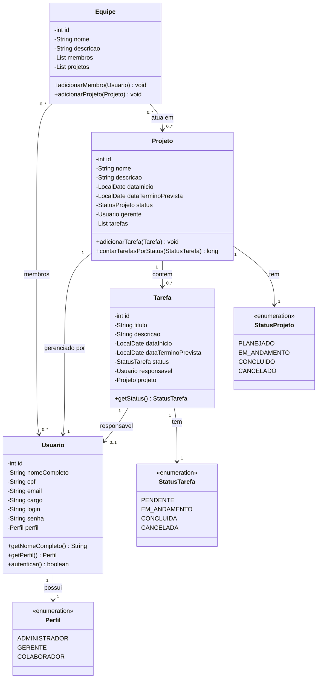

# Diagrama de Classes - Sistema de Gestao de Projetos Oracle

## Representacao Textual

```
+---------------------+        +---------------------+
|       Usuario       |        |       Projeto       |
+---------------------+        +---------------------+
| - id: int           |        | - id: int           |
| - nomeCompleto: Str |        | - nome: String      |
| - cpf: String       |        | - descricao: String |
| - email: String     |        | - dataInicio: Local |
| - cargo: String     |        | - dataTermino: Local|
| - login: String     |        | - status: StatusProj|
| - senha: String     |        | - gerente: Usuario  |
| - perfil: Perfil    |        | - tarefas: List<T>  |
+---------------------+        +---------------------+
| +getNomeCompleto()  |        | +adicionarTarefa()  |
| +getPerfil()        |        | +removerTarefa()    |
| +getLogin()         |        | +contarTarefasPor() |
| +equals()           |        | +getStatus()        |
+---------------------+        +---------------------+
        |                              |
        |  1                           |  1..n
        +------------------------------> 
        |  gerente responsavel         |
        |                              |
        |                     +--------+----------+
        |                     |       Tarefa      |
        |                     +-------------------+
        |                     | - id: int         |
        |                     | - titulo: String  |
        |                     | - descricao: Str  |
        |                     | - dataInicio: Loc |
        |                     | - dataTermino: Loc|
        |                     | - status: Status  |
        |                     | - responsavel: Us |
        |                     | - projeto: Projeto|
        |                     +-------------------+
        | 0..1                | +getStatus()      |
        +---------------------> +getResponsavel() |
             responsavel       +-------------------+
        
+---------------------+
|       Equipe        |
+---------------------+
| - id: int           |
| - nome: String      |
| - descricao: String |
| - membros: List<U>  |
| - projetos: List<P> |
+---------------------+
| +adicionarMembro()  |
| +removerMembro()    |
| +adicionarProjeto() |
| +removerProjeto()   |
+---------------------+
        |               |
        | 0..*          | 0..*
        v               v
    Usuario           Projeto
    (membros)         (projetos)

```

## Enumeracoes

```
Perfil                  StatusProjeto           StatusTarefa
-----------             ---------------         ---------------
ADMINISTRADOR           PLANEJADO               PENDENTE
GERENTE                 EM_ANDAMENTO            EM_ANDAMENTO
COLABORADOR             CONCLUIDO               CONCLUIDA
                        CANCELADO               CANCELADA
```

## Controllers

```
UsuarioController
  - usuarios: List<Usuario>
  - proximoId: int
  + cadastrar(...)
  + atualizar(...)
  + remover(id)
  + buscarPorId(id)
  + buscarPorLogin(login)
  + autenticar(login, senha)
  + listarTodos()
  + listarPorPerfil(perfil)

ProjetoController
  - projetos: List<Projeto>
  + cadastrar(...)
  + atualizar(...)
  + remover(id)
  + buscarPorId(id)
  + listarTodos()
  + listarPorStatus(status)
  + listarPorGerente(usuario)

TarefaController
  - tarefas: List<Tarefa>
  + cadastrar(...)
  + atualizar(...)
  + remover(id)
  + buscarPorId(id)
  + listarTodos()
  + listarPorProjeto(projeto)
  + listarPorResponsavel(usuario)

EquipeController
  - equipes: List<Equipe>
  + cadastrar(...)
  + atualizar(...)
  + remover(id)
  + adicionarMembro(equipeId, usuario)
  + removerMembro(equipeId, usuario)
  + alocarNoProjeto(equipeId, projeto)
  + desalocarDoProjeto(equipeId, projeto)
  + listarPorProjeto(projeto)

RelatorioController
  - projetoController
  - tarefaController
  - equipeController
  - usuarioController
  + relatorioGeralProjetos()
  + relatorioDetalhadoProjeto(projeto)
  + relatorioColaborador(usuario)
  + relatorioEquipes()
  + relatorioTarefasVencidas()
```

## Diagrama Mermaid (compativel com GitHub)


